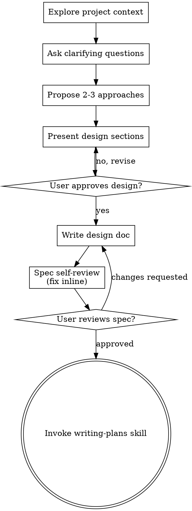

# 将创意头脑风暴转化为设计

通过自然的协作对话，帮助把想法完善为成熟的设计与规格。

首先理解当前项目上下文，然后一次只问一个问题来打磨想法。一旦理解了要构建的内容，就呈现设计并征得用户同意。

<HARD-GATE>
在展示设计并获得用户批准之前，不得调用任何实现类技能、编写代码、搭建项目或采取任何实现动作。无论项目看起来多么简单，这一点都适用于所有项目。
</HARD-GATE>

<HARD-GATE>
**Ganymede Code：** 澄清问题与方案选择 **必须** 调用 `AskUserQuestion`（Question bar）。**禁止** 在 assistant 消息中输出 A/B/C/D 文本选项列表。仅当 `AskUserQuestion` 不可用时才退回纯文本。
</HARD-GATE>

## 反模式："这太简单了，不需要设计"

每个项目都必须经历这个过程。待办清单、单函数工具、配置变更——全都需要。"简单"的项目最容易因为未经审视的假设而造成返工。设计可以很短（真正简单的项目只需几句话），但你必须展示设计并获得批准。

## 检查清单

你必须为以下每一项创建任务，并按顺序完成：

1. **探索项目上下文** — 查看文件、文档、最近的提交
2. **适时提供可视化助手** — 不要一开始就提供。当某个问题第一次明显"看图比描述更清楚"时，再单独提出；用户同意后，浏览器标签页会为你打开。如果整个过程都没有出现适合可视化的问题，就不要提供。详见下方的"可视化助手"部分。
3. **提出澄清问题** — 一次一个，理解目的、约束和成功标准
4. **提出 2–3 种方案** — 附带权衡分析与你的推荐
5. **展示设计** — 按复杂程度分节展示，每节结束后请用户确认
6. **编写设计文档** — 保存到 `docs/kimicodeboost/specs/YYYY-MM-DD-<topic>-design.md` 并提交
7. **规格自检** — 快速检查占位符、矛盾、歧义和范围（见下文）
8. **用户审阅书面规格** — 请用户在继续前审阅规格文件
9. **转入实现** — 调用 writing-plans 技能创建实现计划

## 流程图

**终止状态是调用 writing-plans。** 不要调用 frontend-design、mcp-builder 或任何其他实现类技能。头脑风暴之后只能调用 writing-plans。

## 流程说明

**理解想法：**

- 先检查当前项目状态（文件、文档、最近的提交）
- 在问详细问题之前，先评估范围：如果请求涉及多个独立子系统（例如"搭建一个包含聊天、文件存储、计费和分析的平台"），立即指出。不要花时间先细化一个需要先拆分的项目。
- 如果项目规模过大，不适合一份规格完成，帮助用户拆分为子项目：哪些是独立模块、它们如何关联、应该按什么顺序构建？然后按正常设计流程对第一个子项目进行头脑风暴。每个子项目都有自己的规格 → 计划 → 实现周期。
- 对于规模合适的项目，一次只问一个问题来打磨想法（Ganymede：用 `AskUserQuestion`）
- 尽量使用选择题；开放式问题也通过 `AskUserQuestion` 的 Other 选项收集
- 每条消息 / 每次工具调用只问一个问题——如果一个话题需要深入，拆成多个问题
- 聚焦于理解：目的、约束、成功标准

**探索方案：**

- 提出 2–3 种不同方案并说明权衡
- **用 `AskUserQuestion` 呈现 2–3 个 option**（推荐项放首位并加 `(Recommended)`），不要写成 Markdown A/B/C
- 可在调用工具前用一两句说明权衡，但选项本身必须走 Question bar

**展示设计：**

- 一旦确信理解了要构建的内容，就展示设计
- 根据每节的复杂程度调整篇幅：简单几句话即可，复杂的可写 200–300 字
- 每节结束后用 `AskUserQuestion` 请用户确认是否合适
- 覆盖：架构、组件、数据流、错误处理、测试
- 如果某部分不清楚，随时准备返回澄清

**追求隔离与清晰的设计：**

- 把系统拆分为职责单一的小单元，通过定义良好的接口通信，能够独立理解和测试
- 对每个单元，你都应该能回答：它做什么、如何使用、依赖什么？
- 不读内部实现就能理解一个单元吗？能在不破坏调用方的情况下修改内部实现吗？如果不能，边界就需要调整。
- 更小、边界清晰的单元也更容易处理——你能同时在上下文中理解清楚的代码，推理才更可靠；文件变大通常是职责过多的信号。

**在现有代码库中工作：**

- 在提出改动前先探索现有结构，遵循现有模式
- 如果现有代码存在问题并影响当前工作（例如文件过大、边界不清、职责纠缠），把有针对性的改进纳入设计——就像优秀开发者在工作中顺手改进代码一样
- 不要提议无关的重构，始终围绕当前目标

## 设计完成之后

**文档：**

- 将已确认的设计（规格）写入 `docs/kimicodeboost/specs/YYYY-MM-DD-<topic>-design.md`
  -（用户对规格位置的偏好优先于此默认路径）
- 如果可用，使用 elements-of-style:writing-clearly-and-concisely 技能
- 将设计文档提交到 git

**规格自检：**
写完规格文档后，用新的眼光审视：

1. **占位符扫描：** 是否有 "TBD"、"TODO"、不完整的章节或模糊需求？修复它们。
2. **内部一致性：** 各章节是否相互矛盾？架构是否与功能描述匹配？
3. **范围检查：** 是否足够聚焦以形成单份实现计划，还是需要进一步拆分？
4. **歧义检查：** 是否有需求可以有两种理解？如果是，选择一种并明确说明。

直接在文档中修复问题，无需重新审阅——修复后继续下一步。

**用户审阅关卡：**
规格审阅循环通过后，请用户在继续前审阅书面规格。**Ganymede Code：** 规格写入后会出现在右侧 **计划面板（⌘⇧L）**；引导用户在该面板中阅读，而不是只依赖聊天里的路径：

> "规格已写入 `<path>`，请在计划面板（⌘⇧L）中审阅。如需修改请告诉我；确认后再开始编写实现计划。"

等待用户回复。如果用户要求修改，完成修改后重新运行规格自检循环。只有用户批准后才能继续。

**实现（Ganymede）：**

- 规格审阅通过后，用 `AskUserQuestion` 请用户确认切换到 **计划（Plan）模式** 撰写实现计划。
- **禁止** 在工程模式下直接写实现计划文件或开始编码。
- 用户确认后切换到 Plan 模式，再调用 writing-plans；实现计划必须写入 agent plan 文件并走 ExitPlanMode → Plans 面板 → Build（设计规格与实现计划在面板中分开展示）。
- 不要调用其他技能。下一步是 writing-plans（在 Plan 模式下）。

## 核心原则

- **一次只问一个问题** — 不要让用户被多个问题淹没
- **优先使用选择题** — 在可能的情况下比开放式问题更容易回答
- **坚决践行 YAGNI** — 从所有设计中剔除不必要的功能
- **探索替代方案** — 在确定方案前始终提出 2–3 种选择
- **增量验证** — 先展示设计，获得批准后再继续
- **保持灵活** — 当某部分不清楚时，返回去澄清

## 可视化助手（Ganymede）

在 Ganymede Code 中，用内建 **`GanymedeBrowser`**（必要时配合 `GanymedeSites`）展示原型、布局对比或架构图。**不要**启动 KimiCodeBoost 上游的本地 HTTP 视觉助手服务器，也不要运行 `kimi server` / WebBridge 流程。

**适时提供可视化助手：** 不要一开始就提供。等到某个问题明显「展示出来比口头说明更清楚」时——是真实的原型、布局或图表问题，而不仅仅是 UI *话题*。第一次出现这种情况时，以单独消息提出：
> "接下来这部分如果展示出来可能会更清楚——我可以用 Ganymede 内建浏览器整理原型、图表和对比。需要我打开吗？"

**这条邀请必须是独立消息。** 只能包含邀请，不能夹带澄清问题、总结或其他内容。等待用户回复。如果接受，用 `GanymedeBrowser` 打开本地预览页（可将静态 HTML 写入项目临时路径或通过 `GanymedeSites` 注册后预览）。如果拒绝，继续纯文本对话，除非用户主动提起，否则不再邀请。

**逐问题决策：** 即使用户接受了，也要**对每个问题**单独决定使用浏览器还是文本。判断标准是：**用户通过看到是否比阅读更能理解？**

- **使用 GanymedeBrowser** 呈现本质上是视觉的内容——原型、线框图、布局对比、架构图、并排的视觉设计
- **使用 AskUserQuestion** 呈现概念选择、权衡列表、A/B/C/D 选项、范围决策（禁止 Markdown 文本选项）

关于 UI 话题的问题不自动等于视觉问题。"在这个上下文中 personality 指什么？"是概念问题——用 `AskUserQuestion`。"哪种向导布局更好？"是视觉问题——用 GanymedeBrowser。

工具映射细节见 `ganymede-engineering-bridge` skill。
