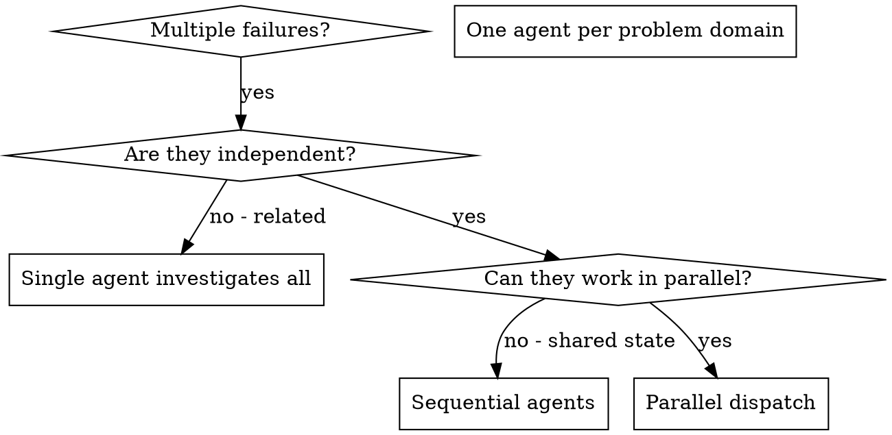

# 并行分派子智能体

## 概述

你将任务委派给拥有独立上下文的专用子智能体。通过精确构建它们的指令和上下文，确保它们保持专注并完成任务。它们绝不应继承你会话的上下文或历史记录——你要自行构建它们所需的全部信息。这样也能为你保留协调工作所需的上下文。

当你遇到多个互不相关的失败（不同的测试文件、不同的子系统、不同的缺陷）时，逐个排查会浪费时间。每次排查都是独立的，可以并行进行。

**核心原则：** 每个独立的问题域派一个智能体，让它们并发工作。

## 何时使用



**使用时机：**
- 3 个及以上测试文件因不同根因而失败
- 多个子系统独立损坏
- 每个问题无需依赖其他问题的上下文即可理解
- 排查之间无共享状态

**不适用场景：**
- 失败相互关联（修复一个可能会连带修复其他）
- 需要理解完整的系统状态
- 智能体之间会互相干扰

## 工作模式

### 1. 识别独立域

按照损坏的内容对失败进行分组：
- 文件 A 测试：工具审批流程
- 文件 B 测试：批量完成行为
- 文件 C 测试：中止功能

每个域都是独立的——修复工具审批不会影响中止测试。

### 2. 创建聚焦的子智能体任务

每个子智能体应获得：
- **明确的范围：** 一个测试文件或子系统
- **清晰的目标：** 让这些测试通过
- **约束：** 不要修改其他代码
- **预期输出：** 你发现了什么、修复了什么的总结

### 3. 并行派发

在同一个回复中发出全部三个子智能体派发请求——它们会并行运行：

```text
Agent (subagent_type: "coder"): "Fix agent-tool-abort.test.ts failures"
Agent (subagent_type: "coder"): "Fix batch-completion-behavior.test.ts failures"
Agent (subagent_type: "coder"): "Fix tool-approval-race-conditions.test.ts failures"
# All three run concurrently.
```

一次回复中的多个派发调用 = 并行执行。每次回复只发一个 = 顺序执行。

### 4. 审阅与整合

当子智能体返回时：
- 阅读每份总结
- 验证修复之间没有冲突
- 运行完整测试套件
- 整合所有变更

### Kimi Code CLI 并发适配

在 Kimi Code CLI 中，并行的动作映射如下：

| 意图 | 动作 |
|------|------|
| 派遣一个实现者子代理 | 调用“派遣子代理”动作，类型指定为 coder |
| 派遣一个只读探索子代理 | 类型指定为 explore |
| 派遣一个架构规划子代理 | 类型指定为 plan |
| 同时派遣多个独立子代理 | 在同一次回复中连续调用多次“派遣子代理” |
| 基于同一模板向多个输入派发 | 使用“批量派遣子代理”动作；同一回复中只能有这一次调用 |
| 子代理结果不需要立即返回 | 使用“后台派遣子代理”并记录任务 ID |

关键约束：
- 批量派遣时，模板中必须包含 `{{item}}` 占位符。
- 并发上限环境变量可限制同时运行的子代理数量；未设置时按默认爬坡策略启动。
- 每个子代理固定 30 分钟超时；预期耗时更长的任务应转为后台。
- 依赖后续子代理结果的任务，必须等待前置子代理完成，不能混入同一批并发调用。

## 子智能体提示结构

优秀的子智能体提示应具备：
1. **聚焦** - 一个清晰的问题域
2. **自包含** - 理解问题所需的全部上下文
3. **输出明确** - 子智能体应该返回什么？

```markdown
修复 src/agents/agent-tool-abort.test.ts 中 3 个失败的测试：

1. "should abort tool with partial output capture" - 期望消息中包含 'interrupted at'
2. "should handle mixed completed and aborted tools" - 快速工具被中止而非完成
3. "should properly track pendingToolCount" - 期望得到 3 个结果，但实际为 0

这些都是时序/竞态条件问题。你的任务：

1. 阅读测试文件，理解每个测试验证的内容
2. 识别根因——是时序问题还是真实缺陷？
3. 通过以下方式修复：
   - 将任意超时替换为基于事件的等待
   - 如果发现中止实现存在缺陷，则修复
   - 如果测试的是已变更的行为，则调整测试预期

不要只是增加超时时间——找到真正的问题。

返回：你发现了什么以及修复了什么的总结。
```

## 常见错误

**❌ 范围过大：** "修复所有测试" - 子智能体会无从下手
**✅ 具体明确：** "修复 agent-tool-abort.test.ts" - 范围聚焦

**❌ 缺少上下文：** "修复竞态条件" - 子智能体不知道位置
**✅ 提供上下文：** 粘贴错误信息和测试名称

**❌ 缺少约束：** 子智能体可能会重构所有代码
**✅ 明确约束：** "不要修改生产代码" 或 "仅修复测试"

**❌ 输出模糊：** "修复它" - 你不知道改了什么
**✅ 输出具体：** "返回根因和变更总结"

## 何时不要使用

**相互关联的失败：** 修复一个可能会连带修复其他 — 应先一起调查
**需要完整上下文：** 理解问题需要查看整个系统
**探索性调试：** 你还不知道哪里出了问题
**共享状态：** 智能体之间会互相干扰（编辑相同文件、使用相同资源）

## 来自会话的真实示例

**场景：** 大规模重构后，3 个文件共 6 个测试失败

**失败：**
- agent-tool-abort.test.ts: 3 处失败（时序问题）
- batch-completion-behavior.test.ts: 2 处失败（工具未执行）
- tool-approval-race-conditions.test.ts: 1 处失败（执行次数为 0）

**决策：** 各域相互独立——中止逻辑、批量完成和竞态条件彼此分离

**派发：**
```
Agent 1 → Fix agent-tool-abort.test.ts
Agent 2 → Fix batch-completion-behavior.test.ts
Agent 3 → Fix tool-approval-race-conditions.test.ts
```

**结果：**
- 智能体 1：将超时替换为基于事件的等待
- 智能体 2：修复事件结构缺陷（threadId 位置错误）
- 智能体 3：添加等待异步工具执行完成的逻辑

**整合：** 所有修复相互独立，无冲突，完整套件全部通过

**节省时间：** 3 个问题并行解决，而非顺序解决

## 核心收益

1. **并行化** - 多项调查同时进行
2. **聚焦** - 每个智能体范围更窄，需要跟踪的上下文更少
3. **独立性** - 智能体之间互不干扰
4. **速度** - 3 个问题在 1 个问题的时间内解决

## 验证

子智能体返回后：
1. **审阅每份总结** - 理解变更内容
2. **检查冲突** - 智能体是否编辑了相同代码？
3. **运行完整套件** - 验证所有修复能否协同工作
4. **抽查** - 智能体可能会出现系统性错误

## 实际效果

来自调试会话（2025-10-03）：
- 3 个文件共 6 处失败
- 并行派发 3 个子智能体
- 所有调查并发完成
- 所有修复成功整合
- 智能体变更之间零冲突
