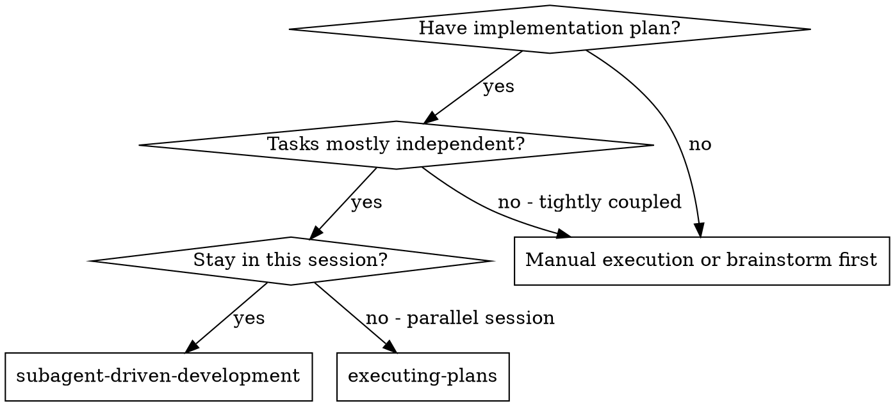
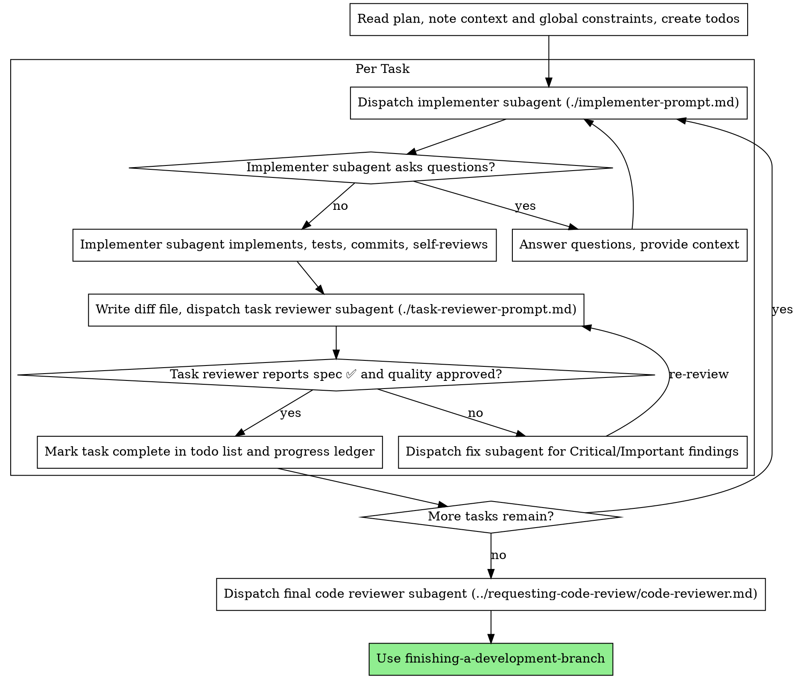

# 子代理驱动开发

通过为每个任务分派一个全新的实现子代理、在每次任务后进行任务评审（规格合规 + 代码质量），并在最后进行一次宽泛的全分支评审，来执行计划。

**为什么使用子代理：** 你将任务委派给具有独立上下文的专门代理。通过精确构造它们的指令和上下文，可确保它们保持专注并完成任务。它们不应继承你当前会话的上下文或历史——你只为它们构建所需信息。这也让你能保留自己的上下文用于协调工作。

**核心原则：** 每个任务都使用全新子代理 + 任务评审（规格 + 质量）+ 宽泛的最终评审 = 高质量、快速迭代

**说明：** 在工具调用之间，最多用一句话进行说明——台账和工具结果会记录一切。

**持续执行：** 不要在任务之间停下来与人类伙伴确认。不间断地执行计划中的所有任务。唯一可停止的原因是：遇到无法解决的 BLOCKED 状态、确实会阻碍进度的歧义，或所有任务均已完成。“是否继续？”这类提示和进度总结会浪费时间——他们要求你执行计划，你就执行它。

## 何时使用



**与 executing-plans（并行会话）的对比：**
- 同一会话（无需切换上下文）
- 每个任务使用全新子代理（不会污染上下文）
- 每个任务后都有评审（规格合规 + 代码质量），最后再有一次宽泛评审
- 迭代更快（任务之间无需人类介入）

## 流程



## 执行前的计划检查

在分派任务 1 之前，先快速扫描一遍计划，检查是否存在冲突：

- 相互矛盾的任务，或与计划的“全局约束”相矛盾的任务
- 计划明确要求的内容，而评审量表却将其视为缺陷的情况（例如断言为空的测试、逐字复制逻辑块）

把你发现的所有问题一次性向人类伙伴提出——每个问题旁边附上要求它的计划原文，并询问应以哪个为准——在执行开始前就问，而不是执行过程中每发现一个就打断一次。如果扫描没有发现问题，则无需说明，直接继续。评审循环仍会兜底那些只有在实现后才显现的冲突。

## 模型选择

为每个角色选择能胜任的最低能力模型，以节约成本并提升速度。

**机械性实现任务**（独立函数、明确规格、涉及 1–2 个文件）：使用快速、便宜的模型。大多数实现任务在计划明确时都属于机械性任务。

**集成与判断任务**（多文件协调、模式匹配、调试）：使用标准模型。

**架构与设计任务**：使用可用的最强模型。最终全分支评审属于此类——应使用可用的最强模型分派，而不是会话默认模型。

**评审任务**：选择与判断需求相匹配的模型，按 diff 的大小、复杂度和风险进行缩放。小的机械性 diff 不需要最强模型；微妙的并发变更则需要。

**分派子代理时务必显式指定模型。** 如果省略模型，子代理会继承你当前会话的模型——通常是最强也最贵的模型——这会悄然抵消本节的意义。

**回合数胜过 token 价格。** 耗时和上下文成本随子代理回合数增长，而最便宜的模型在多步骤工作上往往要多花 2–3 倍回合——总体反而更贵。因此，评审者和基于文字描述进行实现的实现者，至少应使用中等模型。当任务的计划文本已包含要写的完整代码时，实现只是转录加测试：对该实现者使用最便宜档位。单文件机械性修复也使用最便宜档位。

**任务复杂度信号（实现任务）：**
- 涉及 1–2 个文件且规格完整 → 便宜模型
- 涉及多个文件且存在集成问题 → 标准模型
- 需要设计判断或对代码库有广泛理解 → 最强模型

## 处理实现子代理状态

实现子代理会报告以下四种状态之一。分别按对应方式处理：

**DONE：** 生成评审包（`scripts/review-package BASE HEAD`，从本技能目录运行——它会打印写入的唯一文件路径；BASE 是你分派实现者之前记录的提交，绝不要使用 `HEAD~1`，这会静默丢弃多提交任务中除最后一次提交外的所有提交），然后使用打印出的路径分派任务评审者。

**DONE_WITH_CONCERNS：** 实现者完成了工作，但提出了疑虑。在继续前阅读这些疑虑。如果疑虑涉及正确性或范围，先处理再评审。如果只是观察（例如“这个文件越来越大了”），记下来并继续评审。

**NEEDS_CONTEXT：** 实现者需要未提供的信息。提供缺失的上下文后重新分派。

**BLOCKED：** 实现者无法完成任务。评估阻塞原因：
1. 如果是上下文问题，提供更多上下文并使用相同模型重新分派
2. 如果任务需要更多推理能力，使用更强的模型重新分派
3. 如果任务太大，拆分成更小的部分
4. 如果计划本身有误，升级给人类处理

**绝对不要**忽视升级或在未做任何改变的情况下强制相同模型重试。如果实现者表示卡住了，一定有什么需要改变。

## 处理评审者的 ⚠️ 项

任务评审者可能会报告“⚠️ 无法从 diff 中验证”的项——这些需求位于未变更的代码中，或跨越多个任务。它们不会阻塞评审的其余部分，但你在将任务标记为完成之前，必须亲自解决每一项：你掌握着计划以及评审者缺乏的跨任务上下文。如果你确认某项确实是遗漏，则将其视为规格评审失败——退回给实现者并重新评审。

## 构建评审者提示

每个任务评审都是任务范围内的关卡。宽泛评审只发生一次，即在最终全分支评审时。填写评审者模板时：

- 不要添加开放式指令，例如“检查所有用法”或“如有用则运行竞态测试”，除非有具体、任务相关的理由
- 不要要求评审者重新运行实现者已在相同代码上运行过的测试——实现者的报告已经携带了测试证据
- 不要预先判定评审者的发现——永远不要指示评审者忽略或不标记某个特定问题。如果你认为某发现可能是误报，让评审者提出来，再由你在评审循环中裁决。如果你写的提示里出现了“不要标记”“不要把 X 当作缺陷”“最多 Minor”或“计划选择了”——停下：你正在预先判定，通常是为了省掉一次评审循环。
- 你交给评审者的全局约束块是它的关注透镜。从计划的“全局约束”部分或规格中原样复制具有约束力的要求：精确值、精确格式，以及组件之间声明的关系（“与 X 相同布局”“匹配 Y”）。评审者模板已经包含过程规则（YAGNI、测试卫生、评审方法）——约束块用于描述本项目规格的要求。
- 将 diff 作为文件交给评审者：运行本技能的 `scripts/review-package BASE HEAD`，并把打印出的路径传给评审者（如果不使用 bash：将 `git log --oneline`、`git diff --stat` 和 `git diff -U10` 的输出重定向到一个唯一命名的文件）。该输出不会进入你自己的上下文，而评审者可以在一次 Read 调用中看到提交列表、统计摘要和带上下文的完整 diff。使用你在分派实现者之前记录的 BASE——绝不要使用 `HEAD~1`，这会静默截断多提交任务。
- 一条分派提示描述的是一个任务，而不是整个会话的历史。不要粘贴累积的先前任务摘要（“任务 1–3 之后的状态”）到后续分派中——真实会话中的分派曾达到 42k 字符，其中 99% 是粘贴历史。全新的子代理只需要它的任务、它接触的接口和全局约束，仅此而已。
- 对 Critical 和 Important 发现分派修复子代理。Minor 发现随进度记录在台账中，并在最终全分支评审时指向该列表，以便其判断哪些必须在合并前修复。没人看的汇总等于默默丢弃。
- 被标记为计划要求（plan-mandated）的发现——或任何与计划原文要求相冲突的发现——和任何计划矛盾一样，由人类决定：展示该发现及其计划原文，询问以哪个为准。不要因为计划要求就驳回发现，也不要在未询问的情况下分派与计划冲突的修复。
- 最终全分支评审也要获取一个包：运行 `scripts/review-package MERGE_BASE HEAD`（MERGE_BASE = 分支起始的提交，例如 `git merge-base main HEAD`），并将打印出的路径包含在最终评审分派中，这样最终评审者只需读取一个文件，而不必用 git 命令重新推导分支 diff。
- 每次修复分派都带有实现者契约：修复子代理会重新运行覆盖其变更的测试并报告结果。在分派中命名覆盖该变更的测试文件——一行修复不需要整个测试套件。在重新分派评审者之前，确认修复报告包含覆盖测试、运行的命令和输出；三者齐全后再分派重新评审。
- 如果最终全分支评审返回发现，只分派**一个**修复子代理处理完整的发现列表——而不是每个发现各分派一个修复者。每个发现各分派一个修复者都会重建上下文并重新运行套件；真实会话中，最终评审修复波的代价超过了前面所有任务的总和。

## 文件交接

你粘贴到分派提示中的所有内容——以及子代理打印返回的所有内容——都会在你的上下文中驻留整个会话，并在每次后续回合中被重新读取。因此应将工件以文件形式交接：

- **任务简报：** 分派实现者前，先运行本技能的 `scripts/task-brief PLAN_FILE N`——它会将任务的完整文本提取到一个唯一命名的文件并打印路径。构造分派时让简报作为需求的唯一来源。你的分派应包含：(1) 一句话说明该任务在项目中的位置；(2) 简报路径，并说明“请先读这个——它是你的需求，包含要原样使用的精确值”；(3) 简报无法知晓的、来自前面任务的接口和决策；(4) 你对简报中任何歧义的解决方案；(5) 报告文件路径和报告契约。精确值（数字、魔法字符串、签名、测试用例）只出现在简报中。
- **报告文件：** 实现者的报告文件按简报命名（简报 `…/task-N-brief.md` → 报告 `…/task-N-report.md`），并在分派提示中指定。实现者将完整报告写入该文件，仅返回状态、提交、一行测试摘要和疑虑。
- **评审者输入：** 任务评审者获得三个路径——同一个简报文件、报告文件和评审包——以及约束该任务的全局约束。
- 修复分派将其修复报告（含测试结果）追加到同一个报告文件，并返回简短摘要；重新评审时读取更新后的文件。

## 持久化进度

对话记忆在上下文压缩后不会保留。在真实会话中，丢失位置的主控代理曾重新分派整个已完成的任务序列——这是观察到的最昂贵的失败。因此除了待办事项外，还要在台账文件中跟踪进度。

- 技能开始时，检查是否存在台账：
  `cat "$(git rev-parse --show-toplevel)/.kimicodeboost/sdd/progress.md"`。其中标记为已完成的任务视为 DONE——不要重新分派；从第一个未标记完成的任务恢复。
- 当任务的评审干净通过时，在同一消息中追加一行到台账：
  `Task N: complete (commits <base7>..<head7>, review clean)`。
- 台账是你的恢复地图：即使你的上下文不再记得创建过它们，其中命名的提交仍存在于 git 中。压缩后，请相信台账和 `git log`，而不是你自己的记忆。
- `git clean -fdx` 会销毁台账（它是被 git 忽略的临时文件）；如果发生这种情况，请从 `git log` 恢复。

## 提示模板

- [implementer-prompt.md](implementer-prompt.md) - 分派实现子代理
- [task-reviewer-prompt.md](task-reviewer-prompt.md) - 分派任务评审子代理（规格合规 + 代码质量）
- 最终全分支评审：使用 requesting-code-review 的 [code-reviewer.md](../requesting-code-review/code-reviewer.md)

## 示例工作流

```
You: I'm using Subagent-Driven Development to execute this plan.

[Read plan file once: docs/kimicodeboost/plans/feature-plan.md]
[Create todos for all tasks]

Task 1: Hook installation script

[Run task-brief for Task 1; dispatch implementer with brief + report paths + context]

Implementer: "Before I begin - should the hook be installed at user or system level?"

You: "User level (~/.config/kimicodeboost/hooks/)"

Implementer: "Got it. Implementing now..."
[Later] Implementer:
  - Implemented install-hook command
  - Added tests, 5/5 passing
  - Self-review: Found I missed --force flag, added it
  - Committed

[Run review-package, dispatch task reviewer with the printed path]
Task reviewer: Spec ✅ - all requirements met, nothing extra.
  Strengths: Good test coverage, clean. Issues: None. Task quality: Approved.

[Mark Task 1 complete]

Task 2: Recovery modes

[Run task-brief for Task 2; dispatch implementer with brief + report paths + context]

Implementer: [No questions, proceeds]
Implementer:
  - Added verify/repair modes
  - 8/8 tests passing
  - Self-review: All good
  - Committed

[Run review-package, dispatch task reviewer with the printed path]
Task reviewer: Spec ❌:
  - Missing: Progress reporting (spec says "report every 100 items")
  - Extra: Added --json flag (not requested)
  Issues (Important): Magic number (100)

[Dispatch fix subagent with all findings]
Fixer: Removed --json flag, added progress reporting, extracted PROGRESS_INTERVAL constant

[Task reviewer reviews again]
Task reviewer: Spec ✅. Task quality: Approved.

[Mark Task 2 complete]

...

[After all tasks]
[Dispatch final code-reviewer]
Final reviewer: All requirements met, ready to merge

Done!
```

## 优势

**与手动执行相比：**
- 子代理会自然遵循 TDD
- 每个任务都有全新上下文（不会混淆）
- 并行安全（子代理互不干扰）
- 子代理可以在工作前和工作期间提问

**与 executing-plans 相比：**
- 同一会话（无需交接）
- 连续推进（无需等待）
- 评审检查点自动完成

**效率提升：**
- 主控代理精确筛选所需上下文；批量工件以文件而非粘贴文本的形式传递
- 子代理 upfront 获得完整信息
- 问题在工作开始前就暴露出来（而不是之后）

**质量关卡：**
- 自评审在交接前发现问题
- 任务评审给出两个裁决：规格合规和代码质量
- 评审循环确保修复真正有效
- 规格合规防止过度或不足开发
- 代码质量确保实现本身构建良好

**成本：**
- 子代理调用更多（每个任务都有实现者 + 评审者）
- 主控代理需要做更多准备工作（提前提取所有任务）
- 评审循环增加了迭代次数
- 但能尽早发现问题（比事后调试更便宜）

## 警示信号

**绝对不要：**
- 在未获得用户明确同意的情况下，在 main/master 分支上开始实现
- 跳过任务评审，或接受缺少任一裁决的报告（规格合规和任务质量两者都必须）
- 带着未修复的问题继续推进
- 并行分派多个实现子代理（会产生冲突）
- 让子代理读取整个计划文件（改用 `scripts/task-brief` 提供任务简报）
- 跳过场景设定上下文（子代理需要理解任务所处的位置）
- 忽视子代理的问题（在让它们继续前先回答）
- 在规格合规上接受“差不多就行”（评审者发现规格问题 = 未完成）
- 跳过评审循环（评审者发现问题 = 实现者修复 = 再次评审）
- 让实现者的自评审取代实际评审（两者都需要）
- 告诉评审者不要标记什么，或在分派提示中预先评定发现的严重级别（“最多按 Minor 处理”）——计划中的示例代码只是起点，不能证明其弱点是被允许的
- 在没有 diff 文件的情况下分派任务评审者——先使用 `scripts/review-package BASE HEAD` 生成，并在提示中命名打印出的路径
- 在评审仍有 Critical/Important 问题未解决时进入下一个任务
- 重新分派台账已标记为完成的任务——在上下文压缩或恢复后检查台账（和 `git log`）

**如果子代理提问：**
- 清晰、完整地回答
- 必要时提供额外上下文
- 不要催促它们立即开始实现

**如果评审者发现问题：**
- 由实现者（同一个子代理）修复
- 评审者再次评审
- 重复直到通过
- 不要跳过重新评审

**如果子代理任务失败：**
- 分派修复子代理并给出具体指令
- 不要尝试手动修复（会污染上下文）

## 集成

**必需的工作流技能：**
- **using-git-worktrees** - 确保隔离工作区（创建或验证现有工作区）
- **writing-plans** - 创建本技能所执行的计划
- **requesting-code-review** - 最终全分支评审的代码评审模板
- **finishing-a-development-branch** - 完成所有任务后的收尾工作

**子代理应使用的技能：**
- **test-driven-development** - 子代理为每个任务遵循 TDD

**替代工作流：**
- **executing-plans** - 用于并行会话而非同一会话执行
