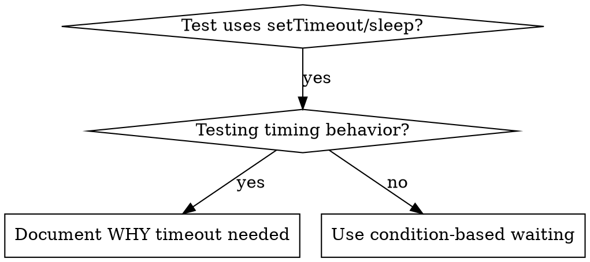

# Condition-Based Waiting

## 概述

不稳定的测试常常通过随意延迟来猜测时机。这会产生竞态条件：测试在性能好的机器上能通过，但在高负载或 CI 环境中却失败。

**核心原则：** 等待你真正关心的实际条件，而不是猜测它需要多久。

## 何时使用



**遇到以下情况时必须使用：**
- 测试中存在任意延迟（`setTimeout`、`sleep`、`time.sleep()`）
- 测试不稳定（有时通过，有时在高负载下失败）
- 测试在并行运行时超时
- 等待异步操作完成

**不要用于：**
- 测试真正的定时行为（防抖、节流间隔）
- 如果必须使用任意超时，务必记录原因

## 核心模式

```typescript
// ❌ 之前：猜测时机
await new Promise(r => setTimeout(r, 50));
const result = getResult();
expect(result).toBeDefined();

// ✅ 之后：等待条件
await waitFor(() => getResult() !== undefined);
const result = getResult();
expect(result).toBeDefined();
```

## 快速模式

| 场景 | 模式 |
|------|------|
| 等待事件 | `waitFor(() => events.find(e => e.type === 'DONE'))` |
| 等待状态 | `waitFor(() => machine.state === 'ready')` |
| 等待数量 | `waitFor(() => items.length >= 5)` |
| 等待文件 | `waitFor(() => fs.existsSync(path))` |
| 复杂条件 | `waitFor(() => obj.ready && obj.value > 10)` |

## 实现

通用轮询函数：

```typescript
async function waitFor<T>(
  condition: () => T | undefined | null | false,
  description: string,
  timeoutMs = 5000
): Promise<T> {
  const startTime = Date.now();

  while (true) {
    const result = condition();
    if (result) return result;

    if (Date.now() - startTime > timeoutMs) {
      throw new Error(`Timeout waiting for ${description} after ${timeoutMs}ms`);
    }

    await new Promise(r => setTimeout(r, 10)); // 每 10ms 轮询一次
  }
}
```

本目录下的 `condition-based-waiting-example.ts` 提供了完整实现，包含来自真实调试会话的域专用辅助函数（`waitForEvent`、`waitForEventCount`、`waitForEventMatch`）。

## 常见错误

**❌ 轮询过快：** `setTimeout(check, 1)` —— 浪费 CPU
**✅ 修正：** 每 10ms 轮询一次

**❌ 没有超时：** 如果条件一直不满足，会永远循环
**✅ 修正：** 始终设置超时，并给出清晰的错误信息

**❌ 数据陈旧：** 在循环外缓存状态
**✅ 修正：** 在循环内调用 getter 以获取最新数据

## 何时使用任意超时是正确的

```typescript
// 工具每 100ms 触发一次——需要 2 次触发来验证部分输出
await waitForEvent(manager, 'TOOL_STARTED'); // 第一步：等待条件
await new Promise(r => setTimeout(r, 200));   // 第二步：等待定时行为
// 200ms = 2 个 100ms 的间隔——已记录并说明理由
```

**要求：**
1. 首先等待触发条件
2. 基于已知的定时（而非猜测）
3. 用注释说明原因

## 实际效果

来自调试会话（2025-10-03）：
- 修复了 3 个文件中的 15 个不稳定测试
- 通过率：60% → 100%
- 执行时间：缩短 40%
- 不再出现竞态条件
