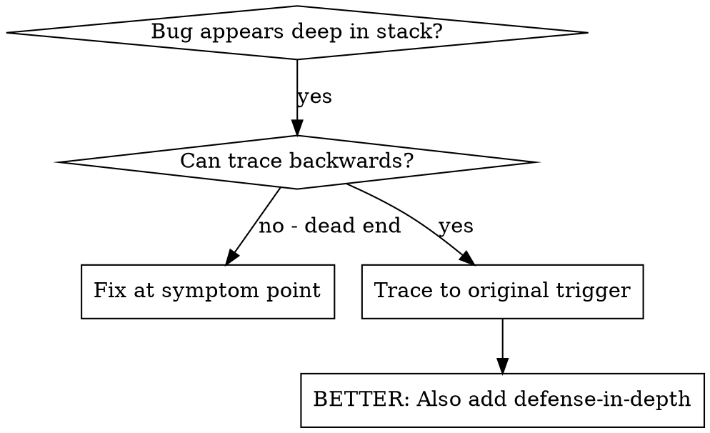
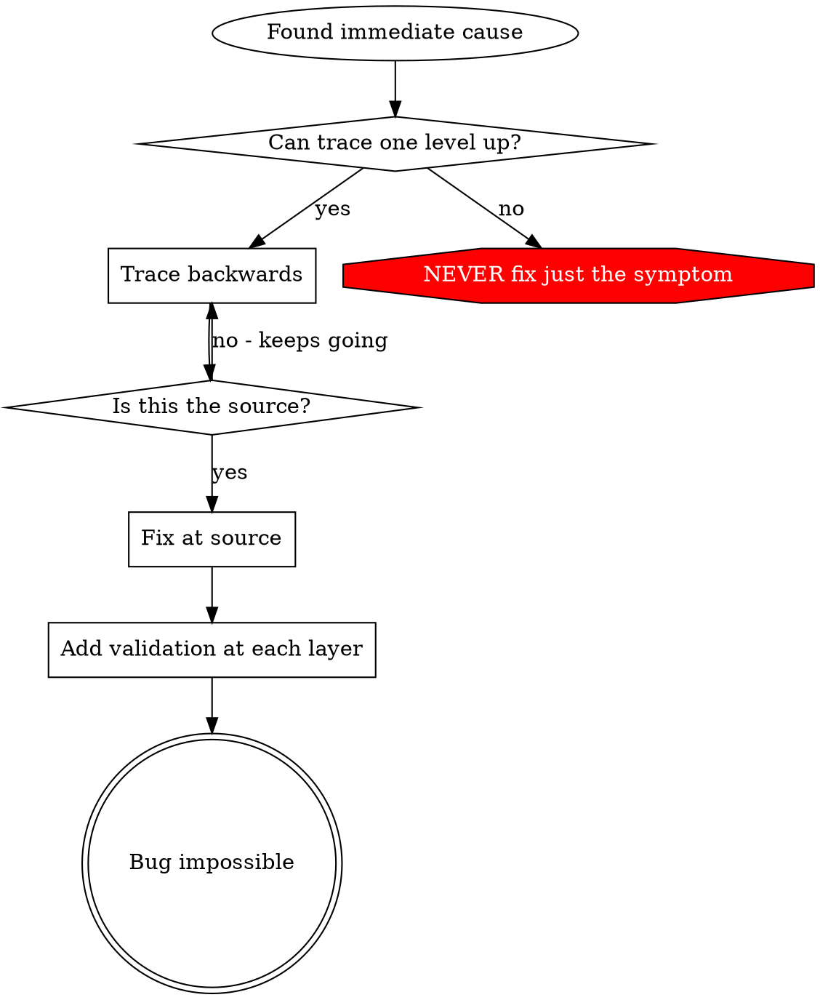

# 根因追踪

## 概述

Bug 往往深藏在调用栈中才显现出来（例如在错误目录执行 `git init`、文件创建到了错误位置、数据库以错误路径打开）。你的第一反应通常是在报错位置直接修复，但这只是在处理症状。

**核心原则：** 沿着调用链逆向追踪，直到找到最初的触发点，然后在源头修复。

## 何时使用



**遇到以下情况时必须启用：**
- 错误发生在执行深处（不在入口点）
- 堆栈跟踪显示出很长的调用链
- 不清楚无效数据来自哪里
- 需要定位是哪个测试/代码触发了问题

## 追踪流程

### 1. 观察症状
```
Error: git init failed in ~/project/packages/core
```

### 2. 查找直接原因
**是什么代码直接导致了这个问题？**
```typescript
await execFileAsync('git', ['init'], { cwd: projectDir });
```

### 3. 追问：谁调用了它？
```typescript
WorktreeManager.createSessionWorktree(projectDir, sessionId)
  → called by Session.initializeWorkspace()
  → called by Session.create()
  → called by test at Project.create()
```

### 4. 继续向上追踪
**传入了什么值？**
- `projectDir = ''` （空字符串！）
- 空字符串作为 `cwd` 会解析为 `process.cwd()`
- 那就是源码目录！

### 5. 找到最初触发点
**空字符串是从哪里来的？**
```typescript
const context = setupCoreTest(); // Returns { tempDir: '' }
Project.create('name', context.tempDir); // Accessed before beforeEach!
```

## 添加堆栈跟踪

当无法手动追踪时，添加探针：

```typescript
// Before the problematic operation
async function gitInit(directory: string) {
  const stack = new Error().stack;
  console.error('DEBUG git init:', {
    directory,
    cwd: process.cwd(),
    nodeEnv: process.env.NODE_ENV,
    stack,
  });

  await execFileAsync('git', ['init'], { cwd: directory });
}
```

**关键：** 在测试中使用 `console.error()`（不要用 logger —— 可能被隐藏）

**运行并捕获：**
```bash
npm test 2>&1 | grep 'DEBUG git init'
```

**分析堆栈跟踪：**
- 查找测试文件名
- 找到触发调用的行号
- 识别模式（同一个测试？同一个参数？）

## 定位造成污染的测试

如果测试过程中出现了某些问题，但不知道具体是哪个测试导致的：

使用本目录下的二分脚本 `find-polluter.sh`：

```bash
./find-polluter.sh '.git' 'src/**/*.test.ts'
```

逐个运行测试，停在第一个污染者处。用法见脚本内部。

## 真实案例：空的 projectDir

**症状：** `.git` 被创建在 `packages/core/`（源码目录）中

**追踪链：**
1. `git init` 在 `process.cwd()` 中运行 ← cwd 参数为空
2. WorktreeManager 被传入了空的 projectDir
3. Session.create() 传入了空字符串
4. 测试在 beforeEach 之前访问了 `context.tempDir`
5. setupCoreTest() 初始返回 `{ tempDir: '' }`

**根本原因：** 顶层变量初始化时访问了空值

**修复：** 将 tempDir 改为 getter，在 beforeEach 之前访问时抛出错误

**同时增加纵深防御：**
- Layer 1: Project.create() 校验目录
- Layer 2: WorkspaceManager 校验非空
- Layer 3: NODE_ENV 守卫禁止在 tmpdir 之外执行 git init
- Layer 4: 在 git init 之前记录堆栈

## 核心原则



**永远不要只在报错位置修复。** 回溯到最初触发点。

## 堆栈跟踪技巧

**测试中：** 使用 `console.error()`，不要用 logger —— logger 可能被抑制  
**操作前：** 在危险操作之前记录日志，而不是等失败之后  
**包含上下文：** 目录、当前工作目录、环境变量、时间戳  
**捕获堆栈：** `new Error().stack` 可展示完整调用链

## 实际效果

来自一次调试会话（2025-10-03）：
- 通过 5 层追踪找到根因
- 在源头修复（getter 校验）
- 增加 4 层防御
- 1847 个测试通过，零污染
