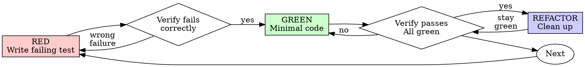

# 测试驱动开发（Test-Driven Development，TDD）

## 概述

先写测试。看着它失败。再写最简代码让它通过。

**核心原则：** 如果你没有看到测试失败，就无法确定它测的是正确的东西。

**违反规则的字面意思，就是违反规则的精神。**

## 何时使用

**始终适用：**
- 新功能
- Bug 修复
- 重构
- 行为变更

**例外（需询问人类伙伴）：**
- 一次性原型
- 生成的代码
- 配置文件

想着“这次就跳过 TDD”？停。这是自我合理化。

## 铁律

```
NO PRODUCTION CODE WITHOUT A FAILING TEST FIRST
```

在测试之前写代码？删掉。重来。

**没有例外：**
- 不要保留作为“参考”
- 不要“适配”已有代码后再写测试
- 不要去看它
- 删除就是删除

完全从测试出发重新实现。就这么简单。

## 红灯-绿灯-重构



### RED - 编写失败的测试

编写一个最简测试，展示期望行为。

<Good>
```typescript
test('retries failed operations 3 times', async () => {
  let attempts = 0;
  const operation = () => {
    attempts++;
    if (attempts < 3) throw new Error('fail');
    return 'success';
  };

  const result = await retryOperation(operation);

  expect(result).toBe('success');
  expect(attempts).toBe(3);
});
```
名称清晰、测试真实行为、只测一件事
</Good>

<Bad>
```typescript
test('retry works', async () => {
  const mock = jest.fn()
    .mockRejectedValueOnce(new Error())
    .mockRejectedValueOnce(new Error())
    .mockResolvedValueOnce('success');
  await retryOperation(mock);
  expect(mock).toHaveBeenCalledTimes(3);
});
```
名称模糊，测试的是 mock 而不是真实代码
</Bad>

**要求：**
- 一个行为
- 名称清晰
- 真实代码（除非不得已，否则不使用 mock）

### Verify RED - 观察测试失败

**强制步骤。绝不可跳过。**

```bash
npm test path/to/test.test.ts
```

确认：
- 测试失败（而非报错）
- 失败信息符合预期
- 失败是因为功能缺失，而不是拼写错误

**测试通过了？** 说明你在测试已有行为。修正测试。

**测试报错？** 修复错误，重新运行，直到它以正确方式失败。

### GREEN - 最简代码

编写最简单的代码让测试通过。

<Good>
```typescript
async function retryOperation<T>(fn: () => Promise<T>): Promise<T> {
  for (let i = 0; i < 3; i++) {
    try {
      return await fn();
    } catch (e) {
      if (i === 2) throw e;
    }
  }
  throw new Error('unreachable');
}
```
只写刚好够通过的代码
</Good>

<Bad>
```typescript
async function retryOperation<T>(
  fn: () => Promise<T>,
  options?: {
    maxRetries?: number;
    backoff?: 'linear' | 'exponential';
    onRetry?: (attempt: number) => void;
  }
): Promise<T> {
  // YAGNI
}
```
过度设计
</Bad>

不要添加功能、重构其他代码，或做超出测试范围的“优化”。

### Verify GREEN - 观察测试通过

**强制步骤。**

```bash
npm test path/to/test.test.ts
```

确认：
- 测试通过
- 其他测试仍通过
- 输出干净（无错误、无警告）

**测试失败？** 修复代码，而非测试。

**其他测试失败？** 立即修复。

### REFACTOR - 清理

只有在绿灯之后：
- 消除重复
- 改善命名
- 提取辅助函数

保持测试通过。不要添加行为。

### Repeat

为下一个功能编写下一个失败测试。

## 好的测试

| 质量 | 良好 | 不良 |
|---------|------|-----|
| **Minimal** | 只测一件事。名称里出现“and”？拆分它。 | `test('validates email and domain and whitespace')` |
| **Clear** | 名称描述行为 | `test('test1')` |
| **Shows intent** | 展示期望的 API | 掩盖代码应该做什么 |

## 为什么顺序至关重要

**“我之后再写测试来验证它能工作”**

后补的测试会立即通过。立即通过什么都证明不了：
- 可能测错了东西
- 可能测的是实现，而不是行为
- 可能漏掉了你遗忘的边界情况
- 你从未看到它抓住 Bug

测试优先迫使你看到测试失败，从而证明它确实在验证某些东西。

**“我已经手动测试过所有边界情况了”**

手动测试是临时性的。你以为自己什么都测了，但：
- 没有测试记录
- 代码变更后无法重新运行
- 压力下容易遗忘用例
- “我试的时候能跑”≠ 全面

自动化测试是系统性的。每次运行方式都相同。

**“删除 X 小时的工作是浪费”**

这是沉没成本谬误。时间已经花掉了。现在的选择是：
- 删除并用 TDD 重写（再花 X 小时，高置信度）
- 保留它并在之后补测试（30 分钟，低置信度，很可能有 Bug）

真正的“浪费”是保留你无法信任的代码。没有真实测试的能跑代码就是技术债务。

**“TDD 太教条，务实的做法是灵活变通”**

TDD 本身就是务实的：
- 在提交前发现 Bug（比事后调试更快）
- 防止回归（测试能立即发现破坏）
- 记录行为（测试展示了如何使用代码）
- 支持重构（放心改动，测试会捕获破坏）

“务实”的捷径 = 在生产环境中调试 = 更慢。

**“后补测试能达到同样的目标——重要的是精神而非仪式”**

不。后补测试回答的是“这段代码做了什么？”测试优先回答的是“这段代码应该做什么？”

后补测试受你已有实现的偏见影响。你测试的是你写的东西，而不是需求。你验证的是你还记得的边界情况，而不是发现的边界情况。

测试优先迫使你在实现前发现边界情况。后补测试只是验证你是否记得一切（你并没有）。

后补 30 分钟测试 ≠ TDD。你得到了覆盖率，却失去了测试真正有效的证明。

## 常见自我合理化

| 借口 | 现实 |
|--------|---------|
| “太简单了，不用测” | 简单代码也会坏。写测试只要 30 秒。 |
| “我之后再测” | 后补测试立即通过，什么都证明不了。 |
| “后补测试能达到同样目标” | 后补测试 = “代码做了什么？” 测试优先 = “代码应该做什么？” |
| “我已经手动测过了” | 临时性 ≠ 系统性。没有记录，无法重跑。 |
| “删除 X 小时的工作是浪费” | 沉没成本谬误。保留未验证的代码就是技术债务。 |
| “保留作为参考，先写测试” | 你会去适配它。这就是后补测试。删除就是删除。 |
| “我需要先探索一下” | 可以。扔掉探索代码，用 TDD 重新开始。 |
| “测试难写 = 设计不清晰” | 倾听测试。难测 = 难用。 |
| “TDD 会拖慢我” | TDD 比调试更快。务实 = 测试优先。 |
| “手动测试更快” | 手动测试无法证明边界情况。每次改动都要重测。 |
| “现有代码没有测试” | 你正在改进它。为现有代码补测试。 |

## 红旗 - 停止并重新开始

- 先写代码再写测试
- 实现后才补测试
- 测试立即通过
- 无法解释测试为什么失败
- “稍后”再加测试
- 自我合理化“就这一次”
- “我已经手动测过了”
- “后补测试目的相同”
- “重要的是精神而非仪式”
- “保留作为参考”或“适配现有代码”
- “已经花了 X 小时，删除是浪费”
- “TDD 太教条，我在务实”
- “这次情况不一样，因为……”

**以上所有情况都意味着：删除代码。用 TDD 重新开始。**

## 示例：Bug 修复

**Bug：** 允许空邮箱

**RED**
```typescript
test('rejects empty email', async () => {
  const result = await submitForm({ email: '' });
  expect(result.error).toBe('Email required');
});
```

**Verify RED**
```bash
$ npm test
FAIL: expected 'Email required', got undefined
```

**GREEN**
```typescript
function submitForm(data: FormData) {
  if (!data.email?.trim()) {
    return { error: 'Email required' };
  }
  // ...
}
```

**Verify GREEN**
```bash
$ npm test
PASS
```

**REFACTOR**
如有需要，为多个字段提取验证逻辑。

## 验证清单

在标记工作完成之前：

- [ ] 每个新函数/方法都有测试
- [ ] 每个测试在实现前都观察过失败
- [ ] 每次失败的原因都符合预期（功能缺失，而非拼写错误）
- [ ] 每次都用最简代码让测试通过
- [ ] 所有测试通过
- [ ] 输出干净（无错误、无警告）
- [ ] 测试使用真实代码（除非不得已，否则不使用 mock）
- [ ] 边界情况和错误情况已覆盖

不能全部勾选？你跳过了 TDD。重来。

## 遇到瓶颈时

| 问题 | 解决方法 |
|---------|----------|
| 不知道怎么测 | 写出期望的 API。先写断言。询问人类伙伴。 |
| 测试太复杂 | 设计太复杂。简化接口。 |
| 必须 mock 所有东西 | 代码耦合过高。使用依赖注入。 |
| 测试 setup 过于庞大 | 提取辅助函数。仍然复杂？简化设计。 |

## 调试与集成

发现 Bug？编写一个能复现它的失败测试。遵循 TDD 循环。测试既能证明修复有效，也能防止回归。

绝不在没有测试的情况下修复 Bug。

## 测试反模式

在添加 mock 或测试工具时，请阅读 [testing-anti-patterns.md](testing-anti-patterns.md) 以避免常见陷阱：
- 测试 mock 行为而不是真实行为
- 为生产类添加仅测试用的方法
- 在不理解依赖的情况下随意 mock

## 最终规则

```
Production code → test exists and failed first
Otherwise → not TDD
```

未经人类伙伴允许，没有任何例外。
