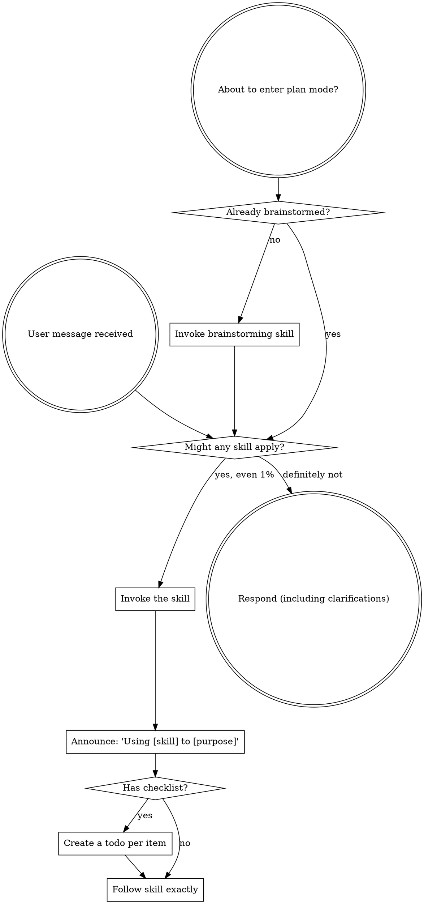

<SUBAGENT-STOP>
如果你是作为子代理被派来执行具体任务的，请跳过此技能。
</SUBAGENT-STOP>

<EXTREMELY-IMPORTANT>
如果你认为某个技能有哪怕 1% 的概率适用于你正在做的事情，你就**必须**调用该技能。

如果某个技能适用于你的任务，你没有选择，**必须使用**它。

这没有商量余地，不是可选项，你不能通过任何理由绕过这一点。
</EXTREMELY-IMPORTANT>

## 指令优先级

KimiCodeBoost 技能会覆盖默认的系统提示行为，但**用户指令始终优先**：

1. **用户的明确指令**（AGENTS.md、直接请求）—— 最高优先级
2. **KimiCodeBoost 技能**—— 在与默认系统行为冲突时覆盖默认行为
3. **默认系统提示**—— 最低优先级

如果 AGENTS.md 说"不要使用 TDD"，而某个技能说"始终使用 TDD"，请遵循用户指令。用户拥有最终控制权。

## 如何访问技能

**切勿使用文件工具手动读取技能文件**——请始终使用 Kimi Code 的 `Skill` 工具加载技能，以确保技能被正确激活。

**在 Kimi Code 中：** 使用原生 `Skill` 工具。调用技能后，其内容会加载并呈现给你——请直接遵循其中的指示。

## 平台适配

技能使用动作式语言来描述操作（"派遣子代理"、"创建待办事项"、"读取文件"），而不指代具体工具名。

- **Ganymede Code：** 优先遵循 `ganymede-engineering-bridge` skill。工程模式切入时会**静默预加载**本技能与 bridge——首次用户消息到来之前，不要先回复、不要占用 turn、不要再手动激活这两个 bootstrap 技能。澄清/多选一律走 `AskUserQuestion`（Question bar），任务跟踪走 `TodoList`，视觉预览走 `GanymedeBrowser`，正式计划走 Plans 面板。
- **Kimi Code CLI：** 工具等价物见 [kimi-tools.md](references/kimi-tools.md)。

# 使用技能

## 核心规则

**在做出任何回应或采取任何行动之前，先调用相关或被请求的技能。** 即使某个技能只有 1% 的适用可能，你也应该调用它来确认。如果调用后发现该技能不适合当前情况，则无需使用它。

## 危险信号

出现以下想法时，请立刻停止——你正在为自己找借口：

| 想法 | 事实 |
|---------|---------|
| "这只是个简单的问题" | 问题也是任务，先检查技能。 |
| "我需要先了解更多背景" | 技能检查优先于澄清性问题。 |
| "我先探索一下代码库" | 技能会告诉你如何探索，先检查技能。 |
| "我可以快速查看一下 git/文件" | 文件缺乏会话上下文，先检查技能。 |
| "我先收集一下信息" | 技能会告诉你如何收集信息。 |
| "这不需要正式使用技能" | 只要存在相关技能，就要使用它。 |
| "我记得这个技能" | 技能会不断演进，请读取当前版本。 |
| "这不算一个任务" | 任何行动都是任务，检查技能。 |
| "用技能太兴师动众了" | 简单的事情也可能变复杂，使用技能。 |
| "我先做这一件事" | 在采取任何行动之前先检查技能。 |
| "这样做很高效" | 无纪律的行动会浪费时间，技能可以防止这一点。 |
| "我知道那是什么意思" | 知道概念不等于使用了技能，请调用它。 |

## 技能优先级

当多个技能可能适用时，请按以下顺序使用：

1. **流程类技能优先**（brainstorming、systematic-debugging）—— 这些决定如何着手处理任务
2. **实现类技能次之**（writing-plans、subagent-driven-development、executing-plans、test-driven-development）—— 这些指导具体执行

"让我们来构建 X" → 先使用 brainstorming，再使用实现类技能。
"修复这个 bug" → 先使用 systematic-debugging，再使用领域相关技能。

## 技能类型

**严格型**（TDD、systematic-debugging）：严格遵循，不要随意放弃其中的纪律要求。

**灵活型**（patterns）：根据上下文灵活调整原则。

技能本身会说明它属于哪种类型。

## 用户指令

用户指令说明的是**做什么**，而不是**怎么做**。"添加 X" 或 "修复 Y" 并不意味着可以跳过工作流程。
