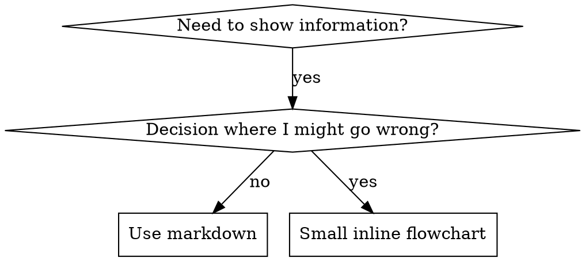

# 编写 Skill

## 概述

**编写 skill 就是将测试驱动开发（TDD）应用于流程文档。**

**个人 skill 存放在 Kimi Code 的用户级 skills 目录中** — 默认路径为 `~/.kimi-code/skills/`。Kimi Code 还会读取跨运行时的共享路径 `~/.agents/skills/`。具体工具映射请参见 [kimi-tools.md](../using-kimicodeboost/references/kimi-tools.md)。

你编写测试用例（使用 subagent 的施压场景），观察它们失败（基线行为），编写 skill（文档），观察测试通过（agent 遵守规则），然后重构（堵住漏洞）。

**核心原则：** 如果你没有观察到 agent 在没有该 skill 时失败，就无法确定这个 skill 是否教对了东西。

**必备背景：** 在使用本 skill 之前，你必须先理解 test-driven-development。该 skill 定义了基础的 RED-GREEN-REFACTOR 循环。本 skill 将 TDD 适配到文档编写。

**官方指南：** 关于通用的 skill 编写最佳实践，可参考 [agentskills.io 规范](https://agentskills.io/specification)。本文档提供额外的模式与指导原则，作为本 skill 中以 TDD 为核心的方法的补充。

## 什么是 Skill？

**skill** 是针对已验证技术、模式或工具的参考指南。skill 帮助未来的 agent 找到并应用有效的方法。

**skill 是：** 可复用的技术、模式、工具、参考指南

**skill 不是：** 关于你曾经如何解决某个问题的叙事

## 面向 Skill 的 TDD 映射

| TDD 概念 | Skill 创建 |
|-------------|----------------|
| **测试用例** | 使用 subagent 的施压场景 |
| **生产代码** | Skill 文档（SKILL.md） |
| **测试失败（RED）** | 在没有 skill 时 agent 违反规则（基线） |
| **测试通过（GREEN）** | 有 skill 时 agent 遵守规则 |
| **重构** | 在保持合规的同时堵住漏洞 |
| **先写测试** | 在编写 skill 之前先运行基线场景 |
| **观察失败** | 记录 agent 使用的具体合理化理由 |
| **最小化代码** | 编写 skill 针对这些具体违规行为 |
| **观察通过** | 验证 agent 现在遵守规则 |
| **重构循环** | 发现新的合理化理由 → 堵上 → 重新验证 |

整个 skill 创建过程遵循 RED-GREEN-REFACTOR。

## 何时创建 Skill

**满足以下条件时创建：**
- 该技术对你并非直观易懂
- 你会在多个项目中再次引用它
- 模式具有广泛适用性（非特定项目）
- 其他人也能从中受益

**不要为以下情况创建：**
- 一次性解决方案
- 其他地方已有完善文档的标准实践
- 特定项目的约定（应放入你的 instructions 文件）
- 机械性约束（如果可以用正则/验证强制约束，就自动化它——把文档留给需要判断的场景）

## Skill 类型

### 技术
带有可执行步骤的具体方法（例如 condition-based-waiting、root-cause-tracing）

### 模式
思考问题的方式（例如 flatten-with-flags、test-invariants）

### 参考
API 文档、语法指南、工具文档（例如 office 文档）

## 目录结构


```
skills/
  skill-name/
    SKILL.md              # Main reference (required)
    supporting-file.*     # Only if needed
```

**扁平命名空间** — 所有 skill 位于同一个可搜索的命名空间下

**拆分到单独文件的情况：**
1. **大量参考资料**（100 行以上）— API 文档、全面语法
2. **可复用工具** — 脚本、工具、模板

**保持内联的情况：**
- 原则与概念
- 代码模式（少于 50 行）
- 其他所有内容

## SKILL.md 结构

**Frontmatter（YAML）：**
- 两个必填字段：`name` 和 `description`（所有支持字段请参见 [agentskills.io/specification](https://agentskills.io/specification)）
- 总计最多 1024 个字符
- `name`：只能使用字母、数字和连字符（不能有括号、特殊字符）
- `description`：第三人称，只描述何时使用（不是描述它做什么）
  - 以 "Use when..." 开头，聚焦触发条件
  - 包含具体的症状、场景和上下文
  - **永远不要总结 skill 的流程或工作流**（原因见 SDO 部分）
  - 尽可能控制在 500 字符以内

```markdown
---
name: Skill-Name-With-Hyphens
description: Use when [specific triggering conditions and symptoms]
---

# Skill Name

## Overview
What is this? Core principle in 1-2 sentences.

## When to Use
[Small inline flowchart IF decision non-obvious]

Bullet list with SYMPTOMS and use cases
When NOT to use

## Core Pattern (for techniques/patterns)
Before/after code comparison

## Quick Reference
Table or bullets for scanning common operations

## Implementation
Inline code for simple patterns
Link to file for heavy reference or reusable tools

## Common Mistakes
What goes wrong + fixes

## Real-World Impact (optional)
Concrete results
```


## Skill 发现优化（SDO）

**发现至关重要：** 未来的 agent 需要找到你的 skill

### 1. 丰富的 Description 字段

**目的：** 你的 agent 会读取 description 来决定为当前任务加载哪些 skill。让它能回答：“我现在应该读这个 skill 吗？”

**格式：** 以 "Use when..." 开头，聚焦触发条件

**关键：Description = 何时使用，而不是 Skill 做什么**

description 只应描述触发条件。不要在 description 中总结 skill 的流程或工作流。

**原因：** 测试发现，当 description 总结了 skill 的工作流时，agent 可能会直接按 description 行事，而不是阅读完整的 skill 内容。一条写着 "code review between tasks" 的 description 导致某个 agent 只做了一次审查，尽管该 skill 的流程图清楚地显示应进行两次审查（先 spec 合规性，再代码质量）。

当 description 改为 "Use when executing implementation plans with independent tasks"（不总结工作流）后，agent 正确地阅读了流程图，并遵循了两阶段审查流程。

**陷阱：** 总结工作流的 description 会成为 agent 走捷径的依据。skill 正文就会变成被 agent 跳过的文档。

```yaml
# ❌ BAD: Summarizes workflow - agents may follow this instead of reading skill
description: Use when executing plans - dispatches subagent per task with code review between tasks

# ❌ BAD: Too much process detail
description: Use for TDD - write test first, watch it fail, write minimal code, refactor

# ✅ GOOD: Just triggering conditions, no workflow summary
description: Use when executing implementation plans with independent tasks in the current session

# ✅ GOOD: Triggering conditions only
description: Use when implementing any feature or bugfix, before writing implementation code
```

**内容：**
- 使用具体的触发条件、症状和场景，表明该 skill 适用
- 描述*问题*（race conditions、inconsistent behavior），而不是*特定语言的症状*（setTimeout、sleep）
- 除非 skill 本身是特定技术的，否则保持触发条件与技术无关
- 如果 skill 是特定技术的，在触发条件中明确说明
- 使用第三人称（注入到 system prompt 中）
- **永远不要总结 skill 的流程或工作流**

```yaml
# ❌ BAD: Too abstract, vague, doesn't include when to use
description: For async testing

# ❌ BAD: First person
description: I can help you with async tests when they're flaky

# ❌ BAD: Mentions technology but skill isn't specific to it
description: Use when tests use setTimeout/sleep and are flaky

# ✅ GOOD: Starts with "Use when", describes problem, no workflow
description: Use when tests have race conditions, timing dependencies, or pass/fail inconsistently

# ✅ GOOD: Technology-specific skill with explicit trigger
description: Use when using React Router and handling authentication redirects
```

### 2. 关键词覆盖

使用 agent 可能会搜索的词：
- 错误信息："Hook timed out"、"ENOTEMPTY"、"race condition"
- 症状："flaky"、"hanging"、"zombie"、"pollution"
- 同义词："timeout/hang/freeze"、"cleanup/teardown/afterEach"
- 工具：实际命令、库名、文件类型

### 3. 描述性命名

**使用主动语态，动词开头：**
- ✅ 用 `creating-skills`，不用 `skill-creation`
- ✅ 用 `condition-based-waiting`，不用 `async-test-helpers`

### 4. Token 效率（关键）

**问题：** getting-started 和频繁引用的 skill 会加载到每一次对话中。每个 token 都很重要。

**目标字数：**
- getting-started 工作流：每个少于 150 词
- 频繁加载的 skill：总共少于 200 词
- 其他 skill：少于 500 词（仍要简洁）

**技巧：**

**将细节移到工具帮助中：**
```bash
# ❌ BAD: Document all flags in SKILL.md
search-conversations supports --text, --both, --after DATE, --before DATE, --limit N

# ✅ GOOD: Reference --help
search-conversations supports multiple modes and filters. Run --help for details.
```

**使用交叉引用：**
```markdown
# ❌ BAD: Repeat workflow details
When searching, dispatch subagent with template...
[20 lines of repeated instructions]

# ✅ GOOD: Reference other skill
Always use subagents (50-100x context savings). REQUIRED: Use [other-skill-name] for workflow.
```

**压缩示例：**
```markdown
# ❌ BAD: Verbose example (42 words)
your human partner: "How did we handle authentication errors in React Router before?"
You: I'll search past conversations for React Router authentication patterns.
[Dispatch subagent with search query: "React Router authentication error handling 401"]

# ✅ GOOD: Minimal example (20 words)
Partner: "How did we handle auth errors in React Router?"
You: Searching...
[Dispatch subagent → synthesis]
```

**消除冗余：**
- 不要重复交叉引用 skill 中已有的内容
- 不要解释从命令中显而易见的内容
- 不要包含同一模式的多个示例

**验证：**
```bash
wc -w skills/path/SKILL.md
# getting-started workflows: aim for <150 each
# Other frequently-loaded: aim for <200 total
```

**根据你做什么或核心洞察来命名：**
- ✅ `condition-based-waiting` 优于 `async-test-helpers`
- ✅ 用 `using-skills`，不用 `skill-usage`
- ✅ `flatten-with-flags` 优于 `data-structure-refactoring`
- ✅ `root-cause-tracing` 优于 `debugging-techniques`

**动名词（-ing）适合流程：**
- `creating-skills`、`testing-skills`、`debugging-with-logs`
- 主动，描述你正在执行的动作

### 5. 交叉引用其他 Skill

**当编写的文档需要引用其他 skill 时：**

只使用 skill 名称，并加上明确的要求标记：
- ✅ 好：`**REQUIRED SUB-SKILL:** Use test-driven-development`
- ✅ 好：`**REQUIRED BACKGROUND:** You MUST understand systematic-debugging`
- ❌ 差：`See skills/testing/test-driven-development`（不清楚是否必须）
- ❌ 差：`@skills/testing/test-driven-development/SKILL.md`（强制加载，浪费上下文）

**为什么不要用 @ 链接：** `@` 语法会立即强制加载文件，在需要之前就消耗 200k+ 上下文。

## 流程图使用



**仅在以下情况使用流程图：**
- 非显而易见的决策点
- 可能过早终止的流程循环
- “何时用 A 而非 B”的决策

**不要在以下情况使用流程图：**
- 参考资料 → 用表格、列表
- 代码示例 → 用 Markdown 代码块
- 线性指令 → 用编号列表
- 没有语义意义的标签（step1、helper2）

本目录中的 `graphviz-conventions.dot` 包含 graphviz 样式规则。

**为人类伙伴可视化：** 使用本目录中的 `render-graphs.js` 将 skill 的流程图渲染为 SVG：
```bash
./render-graphs.js ../some-skill           # Each diagram separately
./render-graphs.js ../some-skill --combine # All diagrams in one SVG
```

## 代码示例

**一个优秀的示例胜过多个平庸的示例**

选择最相关的语言：
- 测试技术 → TypeScript/JavaScript
- 系统调试 → Shell/Python
- 数据处理 → Python

**好的示例：**
- 完整且可运行
- 注释充分，解释原因
- 来自真实场景
- 清晰展示模式
- 易于适配（不是通用模板）

**不要：**
- 用 5 种以上语言实现
- 创建填空模板
- 编写牵强的示例

你很擅长移植——一个出色的示例就够了。

## 文件组织

### 自包含 Skill
```
defense-in-depth/
  SKILL.md    # Everything inline
```
何时：所有内容都能容纳，无需大量参考资料

### 带有可复用工具的 Skill
```
condition-based-waiting/
  SKILL.md    # Overview + patterns
  example.ts  # Working helpers to adapt
```
何时：工具是可复用代码，而不只是叙述

### 带有大量参考资料的 Skill
```
pptx/
  SKILL.md       # Overview + workflows
  pptxgenjs.md   # 600 lines API reference
  ooxml.md       # 500 lines XML structure
  scripts/       # Executable tools
```
何时：参考资料太多，不适合内联

## 铁律（与 TDD 相同）

```
NO SKILL WITHOUT A FAILING TEST FIRST
```

这适用于**新 skill** 以及**对现有 skill 的编辑**。

在测试之前写 skill？删掉它。重新开始。

不测试就编辑 skill？同样是违规。

**没有例外：**
- 即使是“简单补充”
- 即使是“只加一个章节”
- 即使是“文档更新”
- 不要把未测试的更改保留为“参考”
- 不要在运行测试时“适配”
- 删除就是删除

**必备背景：** test-driven-development skill 解释了这为何重要。同样的原则适用于文档。

## 测试所有 Skill 类型

不同类型的 skill 需要不同的测试方法：

### 纪律约束型 Skill（规则/要求）

**示例：** TDD、verification-before-completion、designing-before-coding

**测试方法：**
- 学术问题：它们是否理解规则？
- 施压场景：它们在压力下是否遵守？
- 多种压力组合：时间 + 沉没成本 + 疲劳
- 识别合理化理由并添加明确反驳

**成功标准：** agent 在最大压力下仍能遵守规则

### 技术型 Skill（操作指南）

**示例：** condition-based-waiting、root-cause-tracing、defensive-programming

**测试方法：**
- 应用场景：它们能否正确应用技术？
- 变体场景：它们能否处理边界情况？
- 信息缺失测试：指令是否有遗漏？

**成功标准：** agent 能成功将技术应用到新场景

### 模式型 Skill（思维模型）

**示例：** reducing-complexity、information-hiding 概念

**测试方法：**
- 识别场景：它们能否识别模式何时适用？
- 应用场景：它们能否使用该思维模型？
- 反例：它们是否知道何时不适用？

**成功标准：** agent 能正确识别何时/如何应用模式

### 参考型 Skill（文档/API）

**示例：** API 文档、命令参考、库指南

**测试方法：**
- 检索场景：它们能否找到正确信息？
- 应用场景：它们能否正确使用找到的信息？
- 缺口测试：常见用例是否已覆盖？

**成功标准：** agent 能找到并正确应用参考信息

## 跳过测试的常见合理化理由

| 借口 | 现实 |
|--------|---------|
| "这个 skill  obviously 很清楚" | 对你清楚 ≠ 对其他 agent 清楚。测试它。 |
| "这只是参考资料" | 参考资料也可能有缺口、有不清楚的部分。测试检索。 |
| "测试太过了" | 未测试的 skill 总是有问题。15 分钟测试能节省数小时。 |
| "有问题我再测试" | 问题 = agent 无法使用 skill。在部署前测试。 |
| "测试太繁琐" | 测试比在生产环境中调试糟糕的 skill 要轻松。 |
| "我确信它很好" | 过度自信必然导致问题。还是要测试。 |
| "学术审查就够了" | 阅读 ≠ 使用。测试应用场景。 |
| "没时间测试" | 部署未测试的 skill 会在之后浪费更多时间修复。 |

**所有这些说法的意思都是：部署前必须测试。没有例外。**

## 根据失败类型选择形式

在编写指导之前，先对基线失败进行分类。能防范某一种失败类型的形式，对另一种失败类型可能会明显适得其反。

| 基线失败 | 正确形式 | 错误形式 |
|---|---|---|
| 在压力下跳过/违反规则（明知故犯） | 禁止条款 + 合理化理由表 + 红旗信号（见下方的 Bulletproofing） | 软性指导（"prefer..."、"consider..."） |
| 遵守了，但输出形状错误（提示臃肿、结论被埋没、重复 spec） | 正面配方或契约：说明输出是什么——按顺序列出其组成部分 | 禁止清单（"don't restate"、"never narrate"） |
| 遗漏了已生成内容中的必要元素 | 结构性：在他们填写的模板中设置 REQUIRED 字段或槽位 | 模板附近的文字提醒 |
| 行为应取决于某个条件 | 基于可观察谓词的条件（"if the brief exists, reference it"） | 无条件规则 + 豁免条款 |

**为什么禁止条款在塑造型问题上适得其反：** 在竞争性激励（“让提示自包含”）下，agent 会与 "don't X" 进行协商。在针对 dispatch-prompt 指导的措辞对比测试中，禁止条款组明显产生了更多不想要的内容，分布上与配方组完全分离，甚至比无指导对照组更差——要对自己的案例进行微观测试，而不是假设，但默认不要使用禁止条款。配方式指导没有协商余地：输出要么符合声明的形状，要么不符合。

**无论选择哪种形式，遵循以下规则：**
- **不要加入细微差别条款。** "Don't X unless it matters" 会重新打开协商空间——在获胜的配方后追加一条细微差别条款，在同样的措辞测试中使其从稳定变为嘈杂。将真正的例外表达为基于可观察谓词的独立条件。
- **豁免条款无法限定范围。** "This limit doesn't apply to code blocks" 仍然会抑制代码块。如果输出的某部分必须被豁免，请重构结构，使规则无法触及它。

## 让 Skill 抵御合理化

强制执行纪律的 skill（如 TDD）需要抵御合理化。agent 很聪明，在压力下会寻找漏洞。

**适用范围：** 本工具包针对纪律性失败——即 agent 知道规则却在压力下跳过。对于输出形状错误或遗漏元素的情况，基于禁止的 bulletproofing 会适得其反；请改用“根据失败类型选择形式”中的形式。

**心理学提示：** 理解说服技巧为何有效，有助于你系统地应用它们。关于权威、承诺、稀缺、社会认同和一致性原则的研究基础，请参见 persuasion-principles.md（Cialdini, 2021；Meincke et al., 2025）。

### 明确堵住每个漏洞

不要只陈述规则——要禁止具体的规避方式：

<Bad>
```markdown
Write code before test? Delete it.
```
</Bad>

<Good>
```markdown
Write code before test? Delete it. Start over.

**No exceptions:**
- Don't keep it as "reference"
- Don't "adapt" it while writing tests
- Don't look at it
- Delete means delete
```
</Good>

### 应对“精神 vs 字面”争论

尽早加入基础原则：

```markdown
**Violating the letter of the rules is violating the spirit of the rules.**
```

这能切断整个“我遵循的是精神”类别的合理化理由。

### 建立合理化理由表

从基线测试中捕获合理化理由（见下方的测试部分）。agent 提出的每个借口都要放入表中：

```markdown
| Excuse | Reality |
|--------|---------|
| "Too simple to test" | Simple code breaks. Test takes 30 seconds. |
| "I'll test after" | Tests passing immediately prove nothing. |
| "Tests after achieve same goals" | Tests-after = "what does this do?" Tests-first = "what should this do?" |
```

### 创建红旗信号清单

让 agent 在合理化时能轻松自查：

```markdown
## Red Flags - STOP and Start Over

- Code before test
- "I already manually tested it"
- "Tests after achieve the same purpose"
- "It's about spirit not ritual"
- "This is different because..."

**All of these mean: Delete code. Start over with TDD.**
```

### 为违规症状更新 SDO

在 description 中加入：当你即将违反规则时的症状：

```yaml
description: use when implementing any feature or bugfix, before writing implementation code
```

## 面向 Skill 的 RED-GREEN-REFACTOR

遵循 TDD 循环：

### RED：编写失败的测试（基线）

在没有 skill 的情况下，用 subagent 运行施压场景。记录确切行为：
- 它们做出了什么选择？
- 它们使用了什么合理化理由（原话）？
- 哪些压力触发了违规？

这就是“观察测试失败”——在编写 skill 之前，你必须看到 agent 自然会做什么。

### GREEN：编写最小 Skill

编写针对这些具体合理化理由的 skill。不要为假设性场景添加额外内容。

在加载 skill 的情况下运行相同场景。agent 现在应该遵守规则。

### REFACTOR：堵住漏洞

agent 找到了新的合理化理由？添加明确的反驳。重新测试直到无懈可击。

### 在完整场景前进行措辞微观测试

完整的施压场景运行是最终门槛，但每次迭代都很慢且成本高。先用微观测试验证措辞本身：

1. **每次调用一个全新上下文样本** — 一次原始 API 调用，或者如果你没有 API 访问权限，则使用一次性 subagent。System prompt = 指导将要存在的真实上下文（完整的 skill 或 prompt 模板，而不是孤立指导）；user message = 一个会诱发失败的任务。
2. **始终包含无指导对照组。** 如果对照组没有表现出失败，那就没有什么需要修复的——停止，不要编写指导。
3. **每个变体 5 次以上重复。** 单个样本会骗人。
4. **手动阅读每个被标记的匹配项。** 如果你喜欢可以程序化评分，但模板回声和引用的反例会伪装成命中；仅靠自动计数会夸大失败和成功。
5. **差异是一个指标。** 当指导生效时，多次重复会收敛到相同的形状。五次重复出现五种不同解释意味着措辞不够有约束力——在增加文字之前先收紧形式。

微观测试验证措辞；它们不能替代纪律型 skill 的施压场景。

**测试方法：** 完整的测试方法请参见 [testing-skills-with-subagents.md](testing-skills-with-subagents.md)：
- 如何编写施压场景
- 压力类型（时间、沉没成本、权威、疲劳）
- 系统地堵住漏洞
- 元测试技术

## 反模式

### ❌ 叙事示例
"在 2025-10-03 的会话中，我们发现空的 projectDir 导致……"
**为什么不好：** 过于具体，无法复用

### ❌ 多语言稀释
example-js.js、example-py.py、example-go.go
**为什么不好：** 质量平庸，维护负担重

### ❌ 流程图中的代码
```dot
step1 [label="import fs"];
step2 [label="read file"];
```
**为什么不好：** 无法复制粘贴，难以阅读

### ❌ 通用标签
helper1、helper2、step3、pattern4
**为什么不好：** 标签应具有语义意义

## 停止：在继续下一个 Skill 之前

**在编写任何 skill 之后，你必须停下来并完成部署流程。**

**不要：**
- 不测试就批量创建多个 skill
- 当前 skill 未验证就进入下一个
- 因为“批量更高效”而跳过测试

**下方的部署清单对每一个 skill 都是强制的。**

部署未测试的 skill = 部署未测试的代码。这违反了质量标准。

## Skill 创建清单（TDD 适配版）

**重要：为下方每个清单项创建一个 todo。**

**RED 阶段——编写失败的测试：**
- [ ] 创建施压场景（纪律型 skill 需要 3 种以上组合压力）
- [ ] 在没有 skill 的情况下运行场景——逐字记录基线行为
- [ ] 识别合理化理由/失败中的模式

**GREEN 阶段——编写最小 Skill：**
- [ ] 名称只使用字母、数字、连字符（无括号/特殊字符）
- [ ] YAML frontmatter 包含必填字段 `name` 和 `description`（最多 1024 字符；参见 [spec](https://agentskills.io/specification)）
- [ ] Description 以 "Use when..." 开头，并包含具体的触发条件/症状
- [ ] Description 使用第三人称
- [ ] 全文包含搜索关键词（错误、症状、工具）
- [ ] 概述清晰，包含核心原则
- [ ] 针对 RED 阶段识别的具体基线失败
- [ ] 指导形式与失败类型匹配（参见 Match the Form to the Failure）
- [ ] 对于行为塑造型指导：wording 已在无指导对照组上进行微观测试（5 次以上重复，每个被标记的匹配项都手动阅读）——纯参考型 skill 不适用
- [ ] 代码内联或链接到单独文件
- [ ] 一个优秀的示例（非多语言）
- [ ] 在加载 skill 的情况下运行场景——验证 agent 现在遵守规则

**REFACTOR 阶段——堵住漏洞：**
- [ ] 从测试中识别新的合理化理由
- [ ] 添加明确反驳（如果是纪律型 skill）
- [ ] 根据所有测试迭代建立合理化理由表
- [ ] 创建红旗信号清单
- [ ] 重新测试直到无懈可击

**质量检查：**
- [ ] 仅在决策非显而易见时使用小型流程图
- [ ] 快速参考表
- [ ] 常见错误部分
- [ ] 没有叙事性故事
- [ ] 支持文件仅用于工具或大量参考资料

**部署：**
- [ ] 将 skill 提交到 git 并推送到你的 fork（如果已配置）
- [ ] 考虑通过 PR 回馈（如果具有广泛用途）

## 发现工作流

未来 agent 如何找到你的 skill：

1. **遇到问题**（"tests are flaky"）
2. **搜索 skill**（grep description、浏览类别）
3. **找到 SKILL**（description 匹配）
4. **浏览概述**（是否相关？）
5. **阅读模式**（快速参考表）
6. **加载示例**（仅在实施时）

**为此流程优化** — 尽早并频繁地放置可搜索术语。

## 结论

**创建 skill 就是为流程文档做 TDD。**

同样的铁律：没有先失败的测试，就没有 skill。

同样的循环：RED（基线）→ GREEN（编写 skill）→ REFACTOR（堵住漏洞）。

同样的收益：更好的质量、更少的意外、无懈可击的结果。

如果你为代码遵循 TDD，也请为 skill 遵循它。这是将同样的纪律应用于文档。
